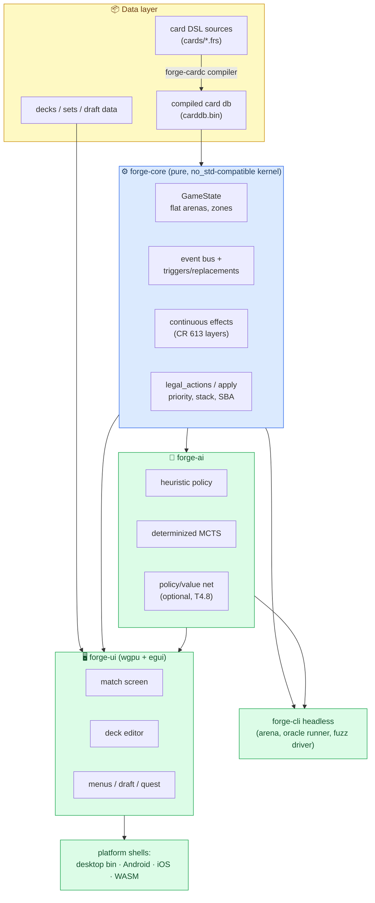
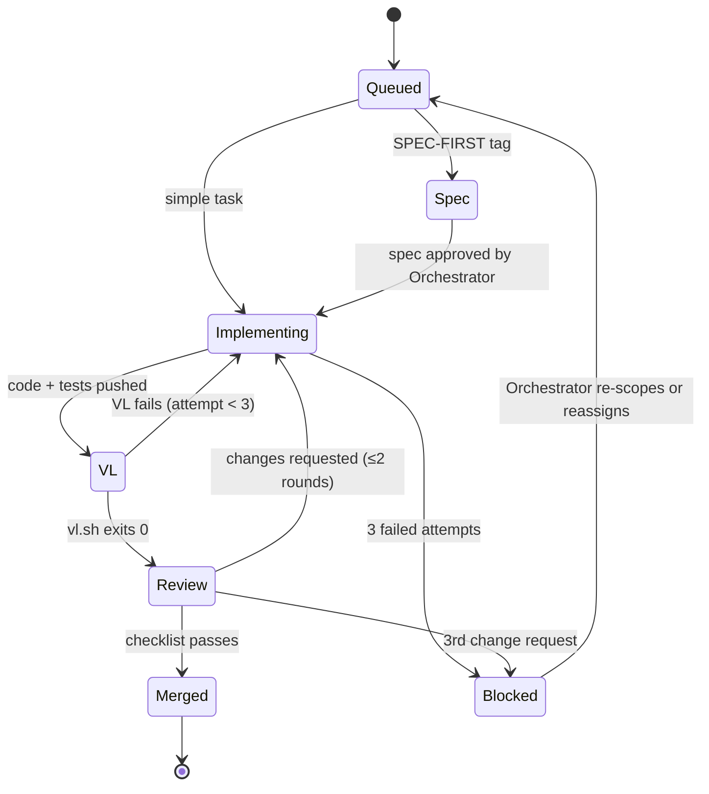
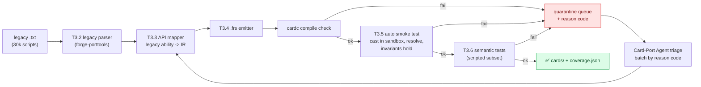
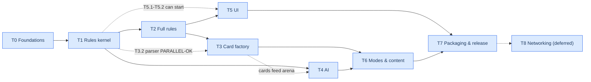

# FORGE-RS REBUILD — MASTER EXECUTION PLAN v1.7

**Status:** Ready for agent orchestration — includes Gate Review & Checkpoint protocol (§15), plan governance (§16), and the Owner Interface (§17: expectation briefs, owner input map, trouble bulletins)
**This document is the sole authority.** If any agent instruction, prior knowledge, or tool default conflicts with this plan, the plan wins; if the plan is ambiguous, use the Question Queue (§15.5) — do not guess.
**Prepared:** 2026-07-05
**v1.3 amendment (2026-07-09):** Owner-approved and Gate-Reviewer-recommended
PC-0001 local-only verification, PC-0002 card identity/coverage contract, and
PC-0003 semantic evidence hardening. See `docs/plan-changes/`.
**v1.4 amendment (2026-07-09):** Owner-approved CP-DSL review remediation:
closed recursive operation-argument signatures, exact mandatory mechanics
strata with catalog-only coverage measured separately, compiled scenario
lowering instead of fixture-provided effects, executed local platform checks,
and exact-commit detached verification before O4.
**v1.5 amendment (2026-07-10):** Owner-approved PC-0004 honest CP-DSL
classification: the 100-card packet is an `unverified_playable` language-stress
corpus. CP-DSL freezes identity, grammar, closed typing, canonical emission,
and database contracts; T3.6 and CP-PORT-20 own per-card semantic promotion to
`verified_playable`.
**v1.6 amendment (2026-07-10):** Owner-approved PC-0005 bounded, corpus-driven
CP-DSL amendment for parameterized keyword values/costs, activation zones and
general phase events, conditional/unless-paid costs, card-choice bindings, and
explicit fight/regenerate operations. The Owner-supplied 365-card Commander
priority list steers mapper order and gets a separate deterministic coverage
report; it does not weaken global coverage or semantic gates.
**v1.7 amendment (2026-07-10):** Owner-approved PC-0006 T3 coverage
acceleration. Full-corpus planning now gathers all independently confirmed
blockers, peels every unknown parameter per node, weights linked-ability
fan-out and Owner-priority cards, and proposes co-occurrence-aware mapper
batches. Local validation uses one shared cache/output and a measured staged
schedule: a saturated materializing sweep followed by hash-only deterministic
replay overlapped with compiler, blocker-planner, and mapping-audit work.
**Prerequisite artifact:** `forge-rs` proof-of-concept (validated: 70 ns state clone, 5,080 playouts/sec, monotonic MCTS difficulty ladder)
**License constraint:** GPL-3.0-only for any component that derives from Card-Forge/forge content (card scripts, AI profiles, rules-test scenarios)[^1]

---

## 📖 Section 0 — How executing agents must use this document

This plan is written to be executed by non-reasoning-heavy agents under an orchestrator. Read this section before doing anything.

### 0.1 Vocabulary

| Term | Meaning |
| --- | --- |
| **Tier** | A strictly ordered execution phase (T0…T8). A tier may not begin until its predecessor's Exit Gate passes, except where a task is explicitly marked `PARALLEL-OK`. |
| **Task ID** | `T<tier>.<seq>` (e.g. `T2.4`). Sub-steps are `T2.4.a`, `T2.4.b`. Agents reference these IDs in every commit message and report. |
| **DoD** | Definition of Done. A task is done only when every DoD command exits `0` and the Review Agent checklist passes. Self-assessment does not count. |
| **Gate** | A machine-runnable script (`scripts/gates/gate_T<k>.sh`) that must exit `0` before the next tier opens. |
| **Oracle scenario** | A serialized game state + action sequence + expected outcome, used as ground truth for rules correctness. |
| **VL (Verification Loop)** | The mandatory per-task loop defined in §0.4. |

### 0.2 Non-negotiable rules for all agents

1. Never integrate a commit with failing exact-commit local verification. GitHub Actions are disabled by Owner decision. Never disable a test to make verification pass; failing tests are escalated, not deleted.
2. Every task branch is `task/T<id>-<slug>`. One task per branch. Squash-merge only.
3. Every commit message begins with the task ID: `T3.2: implement DealDamage ability compiler`.
4. Do not add external crates without an ADR (Architecture Decision Record, §0.6). The dependency budget is deliberately tight (§5.3).
5. If a task fails its DoD 3 consecutive times, STOP, write `reports/blockers/T<id>.md` describing attempts and hypotheses, and hand back to the Orchestrator. Do not brute-force a 4th attempt.
6. All numbers (perf, coverage, card counts) are written to `metrics/*.json` by scripts, never typed by hand.
7. Rules questions are settled by the Magic Comprehensive Rules document (vendored at `docs/vendor/comprehensive-rules.txt`), then by oracle scenarios — never by an agent's memory.[^2]
8. Certain decisions are above every agent's pay grade. Consult the Escalation Matrix (§0.8) before deciding anything not explicitly delegated by a ticket. When in doubt, escalate — a queued question costs hours; a wrong autonomous decision costs a tier.
9. The Owner Interface (§17) is part of the definition of done: Owner Briefs at tier starts/gates/checkpoints, Trouble Bulletins on §17.5 triggers, and the no-surprises rule bind every agent. Telling the Owner what to expect is a deliverable, not a courtesy.
10. Tier Exit Gates and mid-tier checkpoints require sign-off by the **Gate Reviewer** (a human or designated strong reasoning model — §15.1). No agent may self-certify a gate, and `PLAN_STATE.json` gates_passed entries are valid only with a matching `reports/gates/T<k>/SIGNOFF.md`.

### 0.3 Agent roster

The Orchestrator spawns these roles. One agent may hold multiple roles on small tasks, but **Implementer and Reviewer must never be the same agent instance for the same task.**

| Role | Responsibility | Spawn trigger |
| --- | --- | --- |
| **Orchestrator** | Owns the task queue, enforces tier ordering, assigns tasks, arbitrates blockers, owns `PLAN_STATE.json` | Always running |
| **Spec Agent** | Expands a task ID into a written spec (`specs/T<id>.md`) with API signatures, edge cases, test list — before code is written | Any task tagged `SPEC-FIRST` |
| **Implementer** | Writes code + unit tests on the task branch | Every code task |
| **Review Agent** | Runs checklist §0.5 against the diff; may request changes at most twice before escalating | Every task integration |
| **Test Agent** | Executes VL commands, triages failures, writes minimal repro cases into `tests/regressions/` | Every task + local campaign |
| **Fuzz Agent** | Runs invariant fuzzing (§13.4), minimizes crashes, files regression tests | Nightly from T1 onward |
| **Rules-Oracle Agent** | Authors oracle scenarios from the Comprehensive Rules; adjudicates rules disputes; maintains `tests/oracle/` | T1–T3, then on demand |
| **Card-Port Agent(s)** | Runs the batch card-translation pipeline (§8); many instances in parallel | T3 onward |
| **AI Agent** | Implements/search-tunes AI; runs arena evaluations | T4 |
| **UI Agent** | Implements UI per screen specs (§10); produces screenshot diffs | T5 |
| **Perf Agent** | Owns benchmarks, baselines, regression gates | T1 onward, local campaigns |
| **Release Agent** | Packaging, signing, store artifacts (§12) | T7 |
| **Docs Agent** | Keeps `docs/` and ADRs current; generates API docs | Continuous |

### 0.4 The Verification Loop (VL) — run for every task, no exceptions

```bash
# scripts/vl.sh — the canonical per-task verification loop
set -euo pipefail
cargo fmt --all -- --check
cargo clippy --workspace --all-targets --all-features -- -D warnings
cargo build --workspace --all-targets
cargo test --workspace --quiet
cargo test --workspace --quiet --release -- --ignored slow  # slow/scenario tests
scripts/check_coverage.sh 80          # line coverage floor for changed crates
scripts/run_oracle_subset.sh          # oracle scenarios relevant to touched crates
scripts/perf_smoke.sh                 # <5% regression vs metrics/perf_baseline.json
```

Failure handling, in order: (1) Test Agent triages and posts the failing case; (2) Implementer fixes on the same branch; (3) after 3 failed loops → blocker report per §0.2.5.

### 0.5 Review Agent checklist (mechanical; answer YES to all or request changes)

1. Does the diff touch only files within the task's declared scope?
2. Are all new public items documented (`#[deny(missing_docs)]` holds)?
3. Is there at least one test that fails if the core change is reverted? (Reviewer verifies by `git stash`-style revert on a scratch worktree: `scripts/review/mutation_check.sh <PR>`.)
4. No `unwrap()`/`expect()` in non-test engine code paths (grep gate: `scripts/review/no_unwrap.sh`).
5. No new dependencies without a linked ADR.
6. No card-specific logic inside `forge-core` or `forge-ai` (card behavior belongs in data; grep for card names in engine crates must return nothing: `scripts/review/no_card_names.sh`).
7. Determinism preserved: `scripts/review/determinism.sh` replays 50 seeded games twice and diffs final state hashes.
8. Commit message references the task ID and the spec.

### 0.6 ADR protocol

Any architectural choice (dependency, protocol, file format, UI framework change) requires `docs/adr/NNNN-title.md` using the template in `docs/adr/0000-template.md` (Context / Decision / Consequences / Alternatives). ADRs are immutable once merged; supersede, don't edit.

### 0.7 Plan state

`PLAN_STATE.json` at repo root is the single source of truth for progress:

```json
{
  "tier": 2,
  "tasks": { "T2.4": { "status": "in_review", "branch": "task/T2.4-layers", "attempts": 1 } },
  "gates_passed": ["T0", "T1"],
  "metrics_snapshot": "metrics/2026-07-05.json"
}
```

Only the Orchestrator writes it. Every agent reads it at session start.

### 0.8 Escalation Matrix (who may decide what)

| Decision class | Agent alone | Orchestrator | Gate Reviewer (strong model) | Human only |
| --- | :-: | :-: | :-: | :-: |
| Code structure within ticket scope | ✅ | | | |
| Test additions | ✅ | | | |
| Deleting/weakening/`#[ignore]`-ing any existing test | | | | ✅ |
| New dependency (ADR) | | ✅ propose | ✅ approve | |
| Rules interpretation with clear CR citation | ✅ Rules-Oracle | | | |
| Rules interpretation still ambiguous after CR + legacy differential | | | ✅ via Question Queue | |
| Perf baseline change | | ✅ with Perf Agent | | |
| Tier gate sign-off / mid-tier checkpoint sign-off | | | ✅ | ✅ (either) |
| Plan amendment (PLAN-CHANGE, §16.1) | | propose only | recommend | ✅ |
| Anything touching licensing, IP posture, credits screens, network egress | | | | ✅ |
| De-scope ladder invocation (§16.2) | | propose only | | ✅ |
| Kill criteria evaluation (§16.3) | | | ✅ assess | ✅ decide |

### 0.9 Session bootstrap & context budget (for every fresh agent instance)

Agents are assumed to be stateless between sessions and to have finite context. On spawn, read **in this order and nothing more**:

1. `PLAN_STATE.json` (where the project is)
2. Your ticket YAML (what you're doing)
3. `docs/specs/T<id>.md` if it exists (how, precisely)
4. Only the plan sections your ticket lists under `plan_refs:` (the Orchestrator must populate this field on every ticket; default minimum: §0, §3.3)
5. `reports/questions/QUEUE.md` — check whether an answered question affects your task

Do **not** read the whole repository, the whole plan, or the legacy codebase speculatively; request specific files via ticket amendment if scope is wrong. **Resume protocol** after interruption: `git status` on your task branch → if dirty, run `scripts/vl.sh` to learn current state before writing anything → reread your last `reports/` artifact → continue from the first failing DoD item. Never restart a task from scratch because context was lost; the branch and reports are your memory.

---

## 🎯 Section 1 — Project charter

### 1.1 Goal

Rebuild Forge — an unofficial rules engine and AI opponent for Magic: The Gathering with deck editor, constructed/limited/adventure play — as a Rust-core, search-native application whose AI difficulty genuinely scales, and which runs on Windows, macOS, Linux, Android, iOS, and the browser (WASM) from one codebase.

### 1.2 Success metrics (measured, not asserted)

| Metric | Target | Measured by |
| --- | --- | --- |
| Rules correctness | 100% pass on oracle corpus (≥3,000 scenarios by GA) | `scripts/run_oracle.sh` |
| Catalog coverage | 100% of English printing records in the pinned metadata snapshot imported and indexed | `metrics/card_catalog_coverage.json` |
| Identity classification | 100% of source Oracle identities classified as verified playable, unverified playable, quarantined, out-of-v1, or catalog-only | `metrics/card_identity_coverage.json` |
| Playable card coverage | ≥95% of legacy Forge's scripted cards verified playable; quarantined/catalog-only records never count | `metrics/card_coverage.json` |
| AI strength ladder | Each tier ≥65% win rate vs tier below over ≥400 mirror games | `cargo run -p forge-arena` |
| AI latency | Master tier ≤2.0 s/decision desktop, Apprentice ≤150 ms mobile | `metrics/ai_latency.json` |
| State clone | ≤200 ns at 200-card game scale | `cargo bench -p forge-core` |
| Cold start | ≤3 s to main menu on mid-tier Android | Release Agent device farm |
| Memory | ≤400 MB during a Commander (4-player) game | perf harness |
| Crash-free | Fuzzer runs 24 h with zero invariant violations before each release | Fuzz Agent |

### 1.3 Non-goals (v1)

- No online matchmaking service (local hotseat + LAN only; netplay architecture reserved in T8).
- No official WotC art assets shipped in binaries; card images are user-fetched at runtime (§10.8, §14.2).
- No rules coverage for silver-border/joke sets or Un-set mechanics.
- No parity with Forge's every last quest-mode nook in v1; parity list in §11.

### 1.4 Licensing and IP constraints (binding on all agents)

1. The legacy repo and its card scripts are GPL-3.0. Any file mechanically translated from `cardsfolder/`, `res/ai/`, or legacy tests makes the containing distribution GPL-3.0. Decision: **the whole project is GPL-3.0-only.** ADR-0001.
2. Magic: The Gathering is Wizards of the Coast IP. Ship no card art, no set symbols, no mana-symbol fonts from official sources. Use Scryfall's API for user-side image fetching with mandatory local caching and rate-limit compliance (§10.8)[^3], and text rendering fallbacks so the game is fully playable with zero downloads.
3. Card names, rules text, and oracle text are used as game data under the same posture the legacy project has operated with; include the standard Fan Content / unaffiliated disclaimer in About screens and README.
4. Catalog ingestion is metadata/text only. It may not add official art, set symbols, or mana-symbol fonts. Every generated catalog metric records source path, source timestamp, SHA-256, and generator version.

### 1.5 Card identity and coverage terms

- A **printing** is one source catalog record keyed by its stable printing id.
- An **Oracle identity** uses Scryfall `oracle_id` when present. Records without
  one use a deterministic namespaced identity derived from layout and source id.
- Ordered faces for split, adventure, transform, modal DFC, flip, meld, and
  reversible layouts remain under the source-defined game identity.
- Tokens, emblems, art-series, and non-game records remain visible catalog
  records with explicit classification; they cannot count as playable.
- One mechanics `CardDefinition` is compiled per Oracle identity and referenced
  by all printings of that identity. Catalog, identity, playability, and legacy
  parity are separate generated metrics and must never be conflated.

---

## 🗃️ Section 2 — Legacy source-of-truth inventory (what we mine vs. discard)

Agents mine the legacy repo (`github.com/Card-Forge/forge`, vendored read-only at `vendor/legacy-forge/` via git submodule pinned to a commit) as **data and behavioral reference**, not as code to port line-by-line.

| Legacy asset | Path (legacy) | Disposition |
| --- | --- | --- |
| Card scripts (~30k) | `forge-gui/res/cardsfolder/**` | **Mine.** Input corpus for the T3 translation pipeline. Highest-value asset in the project. |
| Ability API semantics | `forge-game/src/main/java/forge/game/ability/**` | **Reference.** Read to write specs for each ability API's semantics; do not port code. |
| AI profiles | `forge-gui/res/ai/*.ai` | **Mine** as heuristic-feature inspiration for the Novice policy + rollout priors. |
| Rules engine | `forge-game/**` (~125k LOC) | **Reference only.** Behavior source when the CR is ambiguous in practice. |
| AI code | `forge-ai/**` (~56k LOC) | **Discard** (architecture superseded); mine `GameStateEvaluator` weights as eval-function starting point. |
| Decks, drafts, quest data | `forge-gui/res/**` (blockdata, precons, quest world) | **Mine** in T6, format-converted. |
| Net code / GUI | `forge-gui-*`, Swing/libGDX layers | **Discard.** |
| Existing unit tests | `forge-game/src/test/**` | **Mine.** Each meaningful test becomes an oracle scenario in T1/T2. |

Task `T0.6` produces `docs/legacy_inventory.md` with exact counts per category (script count per set, ability-API frequency table) via:

```bash
python3 tools/mine_legacy.py --repo vendor/legacy-forge \
  --out metrics/legacy_inventory.json docs/legacy_inventory.md
```

---

## 🏛️ Section 3 — Target architecture (normative)

### 3.1 System overview



### 3.2 Cargo workspace layout (created in T0.2; deviations need an ADR)

```
forge-rs/
├── Cargo.toml                  # [workspace]
├── PLAN_STATE.json
├── crates/
│   ├── forge-core/             # rules kernel. No I/O, no threads, no card names.
│   ├── forge-carddef/          # typed card IR: costs, effects, triggers, layers
│   ├── forge-cardc/            # DSL parser + compiler -> carddb.bin (build tool)
│   ├── forge-cards/            # runtime loader for carddb.bin + card queries
│   ├── forge-ai/               # eval, heuristic policy, MCTS, difficulty tiers
│   ├── forge-testkit/          # scenario format, oracle runner, invariant checks
│   ├── forge-arena/            # headless AI-vs-AI match runner + Elo
│   ├── forge-cli/              # dev CLI: play in terminal, replay, debug dumps
│   ├── forge-ui/               # egui/wgpu UI, platform-agnostic
│   ├── forge-app-desktop/      # winit shell (Win/mac/Linux)
│   ├── forge-app-android/      # cargo-ndk + Gradle shell
│   ├── forge-app-ios/          # static lib + Xcode shell
│   ├── forge-app-wasm/         # wasm-bindgen shell
│   ├── forge-net/              # (T8) lockstep protocol, feature-gated
│   └── forge-porttools/        # legacy DSL parser, translator, coverage reports
├── cards/                      # new-DSL card sources (generated + hand-written)
├── tests/oracle/               # oracle scenarios (*.ron)
├── tools/                      # python mining/report scripts
├── scripts/                    # vl.sh, gates/, review/, perf/
├── metrics/                    # machine-written JSON only
├── docs/adr/  docs/specs/  docs/vendor/
└── vendor/legacy-forge/        # read-only submodule
```

### 3.3 Kernel design invariants (Review Agent enforces; violations block merge)

1. **Flat state.** All game state lives in index-addressed arenas of `Copy`-friendly structs. `GameState: Clone` must stay allocation-shallow; clone benchmark is a CI gate.
2. **Two-function surface.** External consumers see only `legal_actions(&State) -> ActionList`, `apply(&mut State, Action) -> Outcome`, plus read-only queries. No callbacks escape the kernel.
3. **Determinism.** RNG lives inside `GameState`. Same seed + same action list ⇒ bit-identical state hash. Checked by `scripts/review/determinism.sh` on every PR.
4. **Characteristics are computed, not stored.** Power/toughness/types/abilities are derived on demand from base printed values + the ordered continuous-effects list (CR 613). Nothing mutates a creature's power directly.
5. **Cards are data.** The kernel interprets `forge-carddef` IR. A grep for any card name in `forge-core`/`forge-ai` must return zero hits.
6. **Hidden information honesty.** The AI receives a `PlayerView` projection, never `&GameState`. Determinization happens in `forge-ai`, and only from the view.
7. **No panics in the kernel.** All fallible paths return `Result`/`Outcome`; fuzzing treats a panic as a P0 bug.

### 3.4 Threading model

Kernel is single-threaded and `Send`. Parallelism lives above it: MCTS root-parallelizes across determinizations (one thread each, `std::thread` + channels; ADR required to add rayon). UI runs the kernel on a worker thread; UI thread only renders snapshots (`Arc<StateSnapshot>`).

---

## 🤝 Section 4 — Orchestration mechanics

### 4.1 Task lifecycle



### 4.2 Standard task ticket format (Orchestrator emits; agents must refuse malformed tickets)

```yaml
id: T2.4
title: Continuous-effects layer system (CR 613) — layers 1-7 core
tier: 2
tags: [SPEC-FIRST]
scope_paths: [crates/forge-core/src/layers/, crates/forge-carddef/src/effect.rs]
inputs:
  - docs/specs/T2.4.md (Spec Agent output)
  - docs/vendor/comprehensive-rules.txt §613
acceptance:
  - tests/oracle/layers/*.ron all pass (Rules-Oracle Agent delivers ≥40 scenarios first)
  - cargo test -p forge-core layers:: passes
  - clone benchmark regression <5%
verify: scripts/vl.sh && scripts/run_oracle.sh --filter layers
retry_policy: 3 attempts then blocker
depends_on: [T2.1, T2.2]
parallel_ok: false
```

### 4.3 Local verification campaigns (owned by Orchestrator)

| Cadence | Job | Command | Failure action |
| --- | --- | --- | --- |
| Every task integration | Verification Loop | `scripts/local_verify.sh task` | Block integration |
| Every task integration | Determinism replay | `scripts/review/determinism.sh` | Block integration |
| Before each tier gate | Full oracle corpus | `scripts/run_oracle.sh --all` | File P1 task |
| Explicit long campaign | Resource-aware fuzz | `scripts/fuzz_local_parallel.sh` | Minimize + regression test + P0 |
| Before each tier gate | Perf suite vs baseline | `cargo bench --workspace && tools/perf_diff.py` | P1 if >5% regression |
| T3+ task/gate campaign | Card corpus compile + smoke/semantic | `scripts/card_regression.sh` | P1, quarantine list |
| T4+ calibration campaign | Arena ladder (2,000 games) | `cargo run -p forge-arena -- --ladder --games 2000` | AI Agent reviews Elo drift |
| Before each tier gate | Dependency audit | `cargo audit && cargo deny check` | P1 |
| Every 14 days mid-tier | Interim drift review (§15.6) | Gate Reviewer, 1-hour scope | Remediation tickets |
| Per tier + §15.4 list | Gate/checkpoint review | §15 protocol | Tier reopens on failure |

No hosted or background scheduler is assumed. Installing a launch agent,
service, cron entry, VM, simulator, SDK, or other background runner requires
Owner approval. Manual/local campaigns remain mandatory at the listed points.

---

## 🧱 Section 5 — TIER 0: Foundations (repo, toolchain, local verification, gates)

**Objective:** a repository where the Verification Loop, gates, and metrics plumbing all run before any engine code exists.
**Exit Gate `gate_T0.sh`:** empty-workspace `vl.sh` passes; the exact-commit local platform build matrix is green; `mine_legacy.py` report committed.

### T0.1 — Toolchain bootstrap (Implementer)

```bash
rustup toolchain install stable
rustup component add rustfmt clippy llvm-tools-preview
rustup target add wasm32-unknown-unknown aarch64-linux-android aarch64-apple-ios x86_64-pc-windows-msvc
cargo install cargo-llvm-cov cargo-fuzz cargo-deny cargo-audit wasm-bindgen-cli cargo-ndk critcmp
```

DoD: `scripts/check_toolchain.sh` verifies every binary above and pins versions into `rust-toolchain.toml` + `docs/toolchain.lock.md`.

### T0.2 — Workspace skeleton

Create the §3.2 layout with empty lib crates (each containing one doc-comment and one trivial test so the workspace builds and tests green). DoD: `scripts/vl.sh` exits 0.

### T0.3 — Local verification pipeline

`scripts/local_verify.sh` runs `fmt`, `clippy`, native tests, WASM and Android builds, coverage, deny/audit, determinism, and the currently available local platform matrix. Linux and Windows execute in local VMs/containers when those release lanes open; Apple/mobile targets use local simulators/devices. GitHub workflow definitions remain archived outside `.github/workflows/`. DoD: an exact-commit detached-worktree packet records commit SHA, isolated target directories, full logs, toolchain versions, platform results, and artifact hashes.

### T0.4 — Gate/review/metrics scripting

Author `scripts/vl.sh`, `scripts/gates/gate_T0..T8.sh` (stubs that grow per tier), `scripts/review/{mutation_check,no_unwrap,no_card_names,determinism}.sh`, `tools/perf_diff.py`, `tools/metrics_write.py`. DoD: each script has a self-test (`scripts/selftest.sh`).

### T0.5 — Vendor legacy + rules text

```bash
git submodule add https://github.com/Card-Forge/forge vendor/legacy-forge
git -C vendor/legacy-forge checkout <PINNED_COMMIT>   # Orchestrator records SHA in ADR-0002
# Comprehensive Rules: download current CR txt from WotC, store docs/vendor/, record date + URL in ADR-0003
```

### T0.6 — Legacy mining report (`PARALLEL-OK` with T0.3–T0.5)

`tools/mine_legacy.py` parses every legacy card script and emits: total scripts; frequency table of `A:`/`T:`/`R:`/`S:` ability APIs and their parameter keys; keyword frequency; SVar usage stats; per-set counts. This table **drives the T2/T3 implementation order** (most-used APIs first). DoD: `metrics/legacy_inventory.json` exists; top-40 API table rendered in `docs/legacy_inventory.md`.

### 5.3 Dependency budget (initial approved set — anything else needs an ADR)

| Crate | Where | Why |
| --- | --- | --- |
| `serde`, `ron`, `bincode` | testkit/cardc/cards | scenarios + compiled card db |
| `logos` or `pest` | forge-cardc | DSL lexing/parsing (pick one, ADR-0004) |
| `egui`, `eframe`, `wgpu`, `winit` | UI crates | rendering stack (§10) |
| `image`, `ureq` | UI only | card image cache fetcher |
| `criterion` | dev-dep | benchmarks |
| `arbitrary`, `libfuzzer-sys` | fuzz | invariant fuzzing |
| `ort` **or** `candle-core` | forge-ai (feature `nn`) | on-device NN inference, decided in ADR at T4.8 |

Forbidden in `forge-core`: any dependency at all (std-only), to keep it WASM/mobile-trivial and audit-simple.

---

## ⚙️ Section 6 — TIER 1: Rules kernel v1 (playable vanilla Magic)

**Objective:** complete, correct core loop for games using only: lands, vanilla + keyword-simple creatures, sorceries/instants with direct effects; full turn structure, priority, stack, combat, SBAs, mana system, mulligans.
**Exit Gate `gate_T1.sh`:** all T1 oracle scenarios pass (≥250); fuzzer clean 6 h; clone ≤200 ns @ 200-card state; terminal play via `forge-cli` demo game works.

Ordering (each task = the ticket format of §4.2; SPEC-FIRST unless noted):

| Task | Deliverable | Key acceptance detail |
| --- | --- | --- |
| T1.1 | `forge-core` state module: arenas, zones, IDs, snapshots, hashing | State hash function (FNV over canonical serialization) for determinism checks |
| T1.2 | Turn structure + steps/phases per CR 5; untap/upkeep/draw/main/combat steps/end/cleanup as explicit `Step` machine | Oracle scenarios: cleanup discards, "until end of turn" expiry timing |
| T1.3 | Priority + stack per CR 116/608: APNAP, hold-priority, resolve one object, round of priority after each resolution | Scenario: instant responded to by instant responded to by instant, LIFO order asserted |
| T1.4 | Mana system: pools, colors, generic costs, X costs, auto-tap **and** explicit payment plans (UI will need both) | Payment enumerator returns all distinct payment plans ≤64, minimal-waste ordering |
| T1.5 | Casting pipeline per CR 601 (announce→targets→costs→cast) with legality snapshot | Illegal-target fizzle scenarios |
| T1.6 | Combat per CR 506-511: attack/block legality, damage assignment order, first/double strike sub-steps, trample/deathtouch/lifelink/flying/reach/menace/vigilance | ≥60 combat oracle scenarios incl. double-block ordering, trample+deathtouch |
| T1.7 | State-based actions per CR 704 (full list, table-driven) | SBA loop repeats until fixpoint; scenario: simultaneous lethal damage both players = draw |
| T1.8 | Mulligans (London), opening hand, turn-order decision | Deterministic given seed |
| T1.9 | `forge-testkit`: RON scenario schema `{setup, script, expect}`, runner, invariant assertions (zone conservation: every card in exactly one zone; life/counters sanity; hash determinism) | Runner produces JUnit-style XML for CI |
| T1.10 | Port the top 100 legacy `forge-game` unit tests into oracle scenarios (Rules-Oracle Agent) | Mapping table legacy-test → scenario committed |
| T1.11 | `forge-cli` terminal client (play a scripted starter deck vs random bot) | A human can finish a game; replay file (`.frsreplay` = seed + action list) round-trips |
| T1.12 | Fuzz targets: `fuzz_apply` (arbitrary legal action sequences), `fuzz_scenarioparse` | 6 h clean run |
| T1.13 | Criterion benches: clone, legal_actions, apply, full playout; baseline JSON committed | `tools/perf_diff.py` wired into VL |

**Recurring T1 check:** after every merged task, Test Agent runs `scripts/run_oracle.sh --all` and 10k-game random self-play smoke (`cargo run -p forge-arena -- --smoke 10000 --random`) asserting zero invariant violations.

---

## 🧩 Section 7 — TIER 2: Full rules layer (the hard 20%)

**Objective:** the machinery that makes real Magic work: continuous effects, triggered & replacement abilities, activated abilities, targeting/legality engine, counters, tokens, copy effects, multiplayer turn order.
**Exit Gate:** oracle corpus ≥1,200 scenarios green; the "nightmare deck" integration decks (§7.9) play cleanly; fuzz 12 h clean.

| Task | Deliverable | Notes for Implementer |
| --- | --- | --- |
| T2.1 | Event system: every kernel mutation emits a typed `GameEvent`; ring buffer per turn for triggers & replay | Events are data; no closures. This is the substrate for T2.2/T2.3. |
| T2.2 | Triggered abilities per CR 603: subscription tables compiled from card IR, APNAP ordering, intervening-if, delayed triggers | Trigger conditions are declarative predicates over `GameEvent`, interpreted — never card-specific code |
| T2.3 | Replacement/prevention effects per CR 614/615: interception pipeline with self-replacement ordering, affected-object chooses order | Scenario pack: damage prevention vs replacement stacking |
| T2.4 | **Continuous effects — CR 613 layer system.** Layers 1-7 (copy, control, text, type, color, ability, P/T with 7a-7d), timestamps, dependency ordering | The single highest-risk task in the project. Spec Agent writes exhaustive spec; Rules-Oracle delivers ≥80 scenarios BEFORE implementation (test-first mandated). **Merging T2.4 does not close it: the CP-LAYERS checkpoint (§15.4) must be signed off before any T2.5+ task may build on the layer system.** Characteristics computed via `calc_characteristics(state, card_id)` — memoized per action, invalidated on any mutation. |
| T2.5 | Activated abilities incl. mana abilities (no stack), loyalty abilities, cost modifiers/additional costs | |
| T2.6 | Targeting & restriction engine: `ValidTgts`-style predicate language over characteristics (this predicate language is shared with the card DSL — spec jointly with T3.1) | Protection, hexproof, ward, shroud, "can't be blocked", "can't attack" as restriction effects |
| T2.7 | Counters (+1/+1, loyalty, arbitrary named), tokens (creation, ceasing to exist), copy effects (spell + permanent copy semantics per CR 707) | |
| T2.8 | Multiplayer: N-player turn order, range of influence off, Two-Headed Giant OUT of scope v1, Commander framework hooks (command zone, tax, color identity validation) | Commander is a v1 headline feature (largest legacy player base) |
| T2.9 | Keyword library, wave 1 (by T0.6 frequency table): flash, defender, haste, hexproof, indestructible, prowess, scry/surveil, kicker, flashback, cycling, equip, enchant/auras, sacrifice costs, ETB/dies triggers plumbing | Each keyword = data-level desugaring into IR primitives wherever possible |
| T2.10 | The "nightmare deck" integration suite: hand-authored decks exercising layer interactions (e.g., Humility-class effects, Opalescence-class, Blood Moon-class), played 1,000 games by random-legal bots with invariants on | Curated by Rules-Oracle Agent; failures become oracle scenarios |

**Recurring T2 check (in addition to VL):** `scripts/run_oracle.sh --all` per merge; weekly *rules-drift review* where Rules-Oracle Agent samples 20 random scenarios, re-derives expected outcomes from the CR text alone, and confirms the expectations files haven't ossified around implementation bugs.

---

## 🃏 Section 8 — TIER 3: Card catalog + DSL + mass-porting pipeline

**Objective:** a complete printing/identity catalog, a typed card DSL, a compiler, and a translation factory that converts legacy `cardsfolder` scripts at scale with automated semantic verification. This tier runs **partially in parallel with late T2** (`PARALLEL-OK` where marked) and continues as a background production line for the rest of the project.
**Exit Gate:** 100% of English printing records imported, 100% of Oracle identities classified, ≥60% of legacy scripts translated and passing smoke+semantic tests, translation line fully automated end-to-end, card-driven nightmare integration green, and the coverage dashboard live.

### 8.1 Catalog and DSL design (T3.1, SPEC-FIRST, joint spec with T2.6)

The catalog stores versioned `PrintingRecord`s and ordered faces separately from
mechanics. One validated `CardDefinition` per §1.5 Oracle identity lowers into
the same predicate/effect vocabulary used by the kernel; printings reference
that identity. The source metadata provenance is mandatory and generated.

New DSL `.frs` — human-writable, machine-emittable, one card per file, deliberately close in vocabulary to the legacy format to maximize translator fidelity. Example target:

```
card "Abrade" {
  cost: {1}{R}
  types: Instant
  effect: choose_one {
    mode { deal_damage 3 target: creature }
    mode { destroy target: artifact }
  }
}
```

Compiler `forge-cardc`: parse source AST → resolve/type-check → validated typed IR (`forge-carddef`) → kernel-lowered IR → versioned `carddb.bin` (bincode) + `carddb.index.json`. Unknown types, keywords, selectors, operations, references, and costs are compile errors, never open-ended runtime variants. DoD: compiler round-trips (parse→emit→parse) losslessly; error messages carry file/line/column; three clean builds have identical hashes.

**CP-DSL threshold:** 100 reviewer-authored language-stress definitions across
the exact 25 mandatory mechanics strata declared in `docs/specs/T3.1.md`, with
exactly four cards per stratum. These definitions are `unverified_playable`:
they exercise the language but do not claim card-specific semantic
equivalence. Promotion to `verified_playable` requires card-specific semantic
evidence in T3.6 or CP-PORT-20. Catalog-only records are classified and checked
separately; they are not mechanics definitions. Every operation declares recursively
enforced argument types; prose, bare symbols, and category-correct but
argument-wrong trees fail compilation. All 100 cards round-trip; at least 50
malformed sources produce file/line/column diagnostics; curated
parser/compiler mutants achieve ≥90% kill rate with no surviving P0/P1
validation mutant; corpus expressiveness and deterministic database hashes are
included in the checkpoint packet. Ten layer scenarios must compile into a
separate versioned database and lower into kernel effects without an
independently executable fixture effect list. All five local fuzz targets must
pass at least 2,400 aggregate address-sanitizer worker-seconds, with duration
extended automatically on lower-core machines to preserve the aggregate floor.
The local gate executes all semantic oracle packs, four isolated cross-target
checks, and three clean deterministic compiler builds.

PC-0005 permits a bounded evidence-driven amendment after the initial freeze
for five corpus-proven operation families: parameterized keyword values/costs,
activation zones and general phase events, conditional/unless-paid costs,
card-choice bindings, and explicit fight/regenerate operations. Each addition
must remain closed and typed, round-trip canonically, reject approximation, and
land with structural tests before the operation surface is re-frozen.

### 8.2 The translation factory (T3.2–T3.6)



| Task | Deliverable |
| --- | --- |
| T3.2 (`PARALLEL-OK` with T2.5+) | Legacy-format parser: full grammar for `A:`/`T:`/`R:`/`S:`/`K:`/`SVar:` lines into a legacy-AST; must parse ≥99.5% of corpus (parse-only) |
| T3.3 | API mapper: table-driven translation of each legacy ability API + parameter set into IR. Implementation order combines T0.6 frequency, Owner priority, linked fan-out, and the deterministic all-confirmed-blocker co-occurrence plan. Each mapping family lands with its own test pack. `metrics/api_coverage.json` tracks {api, legacy_uses, mapped, verified}; `metrics/blocker_plan.json` records blocker families and recommended batches. |
| T3.4 | `.frs` emitter + resource-aware local batch driver: `cargo run -p forge-porttools -- translate --all --jobs <N>` plus deterministic tier-aware reporting for `assets/coverage_priority.txt`, output fingerprints, hash-only replay, and `scripts/t3_parallel_sweep.sh` development/checkpoint modes. |
| T3.5 | Auto smoke harness: for every translated card, synthesize a sandbox state where it is castable/playable, execute, assert invariants + expected zone destinations. Zero human input per card. |
| T3.6 | Semantic test packs: for the top 2,000 play-rate cards (list mined from legacy precons + draft data), Rules-Oracle Agent writes behavior scenarios (e.g., "Lightning Bolt to face = 3 less life"). |
| T3.7 | Coverage dashboard: `tools/coverage_report.py` → `docs/CARD_COVERAGE.md` with separate catalog/identity/playable/legacy metrics, per-set %, quarantine reason histogram, provenance, and API gaps feeding new T2.x keyword tasks. |
| T3.8 | Hand-port lane: quarantined cards whose reason code is `NEEDS_NEW_PRIMITIVE` generate spec tickets automatically (`tools/quarantine_to_tickets.py`) routed to T2 backlog. |

**Card-Port Agent operating procedure (spawn N in parallel; each owns one quarantine reason-code batch):**

On the current 24-core local host, full translation campaigns use at most 24
workers in the single shared output/cache tree. Simultaneous materializing
translation sweeps are forbidden: measurement showed that their filesystem
and memory contention lengthens the critical path. The checkpoint schedule
first gives all 24 workers to one materializing sweep, then overlaps a
12-worker hash-only replay with a 6-worker blocker plan, mapping audit, and
translated-card compiler. Reports are normalized only for worker-count
metadata; output fingerprints, quarantine records, and priority results must
match byte-for-byte. No GitHub Actions, duplicate Cargo caches, duplicate
output trees, or duplicate worktrees are used for routine T3 verification.

The inner development loop runs `scripts/t3_parallel_sweep.sh development`:
translation, all-confirmed-blocker planning, mapping audit, and focused
porttools tests share the host, followed by card database build/validation.
The integration/checkpoint loop runs `scripts/t3_parallel_sweep.sh checkpoint`
and additionally requires deterministic replay plus full workspace fmt,
clippy, tests, and coverage. A fast development result never substitutes for
the full integration gate.

All-confirmed-blocker batching follows this order:

1. Scan every root ability, reachable SVar ability, and keyword; repeatedly
   remove each diagnosed unknown parameter and re-evaluate the node.
2. Build per-card blocker sets and rank reusable families by global card
   impact, Owner-priority impact, linked-root fan-out, and an explicit effort
   prior that favors parameter lowerings over similarly valuable new APIs.
3. Implement one recommended multi-family batch with structural tests for
   every family; never claim projected cards as translated before the real
   translator emits and compiler-roundtrips them.
4. Run the development loop while editing and the checkpoint loop before
   integration. Refresh the plan after each landed batch so newly exposed
   value-level blockers influence the next recommendation.
5. Measure translated cards per engineering hour across the next three
   batches. The target is 2-3x the pre-PC-0006 throughput; it is a measured
   target, not a completion claim. If the observed gain is below 1.5x, retune
   batch size/ranking before adding workers.

1. `cargo run -p forge-porttools -- legacy blocker-plan --jobs <N> --batch-size 5 --batch-count 6`
2. Diagnose the recommended reusable families; patch the mapper or file a primitive ticket.
3. Re-run the local development sweep; then run the full checkpoint before integration and attach before/after counts.
4. Never hand-edit generated `.frs` files to force a pass — fix the pipeline (hand-written cards live only under `cards/handwritten/` with a linked ticket).

**Recurring T3 check:** each T3 integration and explicit local campaign runs `scripts/card_regression.sh`, recompiling every in-scope playable definition, validating every catalog/classification record, and rerunning smoke + semantic packs. Out-of-v1/catalog-only records must be classified but do not count as playable. Newly failing cards auto-quarantine with a git-bisect hint.

Before the T3 exit gate, all ten T2 nightmare fixture classes are represented by
compiled cards/decks or scenarios and flow through cardc, the runtime card
loader, casting/activation, and normal game actions. Direct kernel fixtures stay
as unit-level support but no longer stand in for card integration.

---

## 🧠 Section 9 — TIER 4: AI system (the headline feature)

**Objective:** an AI that is honest (no hidden-info peeking), fast enough for phones, and *actually good*, with difficulty tiers that differ in real strength.
**Exit Gate:** ladder metric from §1.2 holds on 3 archetype decks (aggro/midrange/control) with 400+ games per rung; latency budgets met on reference hardware; AI plays all shipped cards with zero card-specific code (grep gate).

| Task | Deliverable | Detail |
| --- | --- | --- |
| T4.1 | `PlayerView` projection + determinizer | View includes known-info tracking (revealed cards stay known). Determinizer samples opponent hidden zones consistently with revealed info + deck legality. |
| T4.2 | Evaluation function v1 | Features: life, board material (P/T, keywords weighted), card advantage, mana development, tempo. Seed weights mined from legacy `GameStateEvaluator`. All weights in `ai_weights.ron` — data, not code. |
| T4.3 | Heuristic policy (Novice + rollout policy) | One-ply greedy over `apply`+eval, with noise knob. Also serves as MCTS rollout policy and as move-ordering prior. |
| T4.4 | Determinized MCTS v1 (root-parallel UCT) | Ports the PoC design: per-determinization trees, visit-sum action selection.[^4] |
| T4.5 | Search upgrades | Transposition table keyed on state hash; progressive widening for attack/block combinatorics; action abstraction (group equivalent targets); time-based budgets (`think_ms`) instead of iteration counts. |
| T4.6 | Difficulty tier definition + arena calibration | Tiers = {policy, think_ms, determinizations, noise, mulligan quality}. `forge-arena --calibrate` binary-searches think_ms so each rung hits 65–75% vs the rung below; results into `ai_tiers.ron`. |
| T4.7 | Behavioral guardrails | Table-driven "don't do obviously dumb things" filters for low tiers only (e.g., Novice may bolt own creature; Expert may not) — implemented as action-prior penalties, not hard rules, so search can still override when correct. |
| T4.8 | (Optional, feature-flag `nn`) Learned policy/value net | Self-play data from arena (`--emit-training-data`), small ResNet/MLP over hand-crafted state planes, AlphaZero-style PUCT integration; export ONNX; on-device via `ort`/`candle` per ADR. Ship only if it beats T4.5 Master by ≥60% at equal latency. |
| T4.9 | AI latency harness | `metrics/ai_latency.json` per tier on: desktop reference, Android reference (arm64 mid-tier), WASM. Local perf gate. |
| T4.10 | Explainability hooks for UI | Top-3 considered lines with visit counts + eval deltas, exposed via `forge-ai::api::LastDecisionReport` — powers the UI "AI hint" and postgame review features. |

**Recurring T4 check:** each calibration campaign runs the 2,000-game ladder (§4.3); Elo per tier is tracked in `metrics/elo_history.json`; any rung inversion is a P1.


---

## 🖥️ Section 10 — TIER 5: UI (desktop, mobile, web from one codebase)

**Objective:** a complete player-facing application: match play, deck editor, collection, limited modes UI, settings — built once in `forge-ui` (egui on wgpu), shipped through four thin shells.
**Framework decision (ADR-0005):** egui + wgpu + winit. Rationale: pure Rust (no FFI seams for the core), compiles to all six targets including WASM, immediate-mode fits a heavily stateful game UI, proven mobile embedding via cargo-ndk/Xcode static lib. Recorded fallback if egui hits a wall on mobile text-input/IME: Flutter shell over `forge-ffi` C ABI — the core is UI-agnostic either way, so this risk is contained.
**Exit Gate:** full game playable start-to-finish with mouse-only, touch-only, and keyboard-only on all targets; screenshot-diff suite green; usability script (§10.9) passes.

### 10.1 UI architecture rules

1. UI never touches `GameState` directly. It renders `StateSnapshot` (an `Arc`-shared, UI-oriented projection incl. per-player visibility) and submits `PlayerAction`s to the engine worker thread via a channel. This is the same `PlayerView` boundary the AI uses — one API, two consumers.
2. Every screen is an `egui` module in `forge-ui/src/screens/` with a pure `fn ui(ctx, &ScreenState) -> Vec<UiIntent>` shape; intents are handled centrally (testable without rendering).
3. All layout constants, colors, spacing in `forge-ui/src/theme.rs` (light/dark/high-contrast + colorblind-safe mana palette).
4. Animations are interruptible and skippable; a `reduced_motion` setting disables all of them. Game logic never waits on animation.

### 10.2 Screen inventory and build order (each row = one UI Agent task, T5.x in this order)

| # | Screen | Key elements | Acceptance highlights |
| --- | --- | --- | --- |
| T5.1 | App shell + navigation + settings | Router, theme, input map, audio hooks, profile store (RON in platform data dir) | Cold start ≤3 s reference Android |
| T5.2 | **Match screen — core board** | Battlefield zones per player (1v1 + 4-player Commander layouts), hand fan, library/graveyard/exile piles with browsers, life/counters widgets, phase strip, priority indicator | 200-permanent stress board ≥60 fps desktop / ≥30 fps mobile |
| T5.3 | Match screen — stack & targeting | Stack visualization (ordered cards with controller badges), targeting arrows (bezier overlays), target legality highlighting, choose-mode dialogs, X-cost and payment-plan picker (from T1.4 enumerator) | Every choice the engine can ask has a UI affordance — enumerated by walking the kernel `Choice` enum; VL asserts exhaustive match |
| T5.4 | Match screen — combat | Attack declaration (tap-to-attack, drag to planeswalker/player), block assignment with damage-order reordering, first-strike sub-step clarity | Usability script step 7 |
| T5.5 | Priority & stops system | Full-control vs auto-yield modes, per-step stop toggles (like legacy Forge's phase config), "hold priority" key, auto-pass with pending-trigger interrupt | Configurable per opponent-turn/own-turn |
| T5.6 | Card inspection | Long-press/hover zoom, oracle text panel, rulings tab (offline data), token/copy provenance ("what made this") | |
| T5.7 | **Deck editor** | Collection grid with virtualized scrolling (30k cards), filter DSL (name/type/color/cmc/set/text regex), curve + color stats panels, format legality validation, import/export (`.dck` legacy + MTGA text + plain lists) | Filter over 30k cards <16 ms/keystroke (index built at load) |
| T5.8 | Limited: draft UI | Pack view, pick timer optional, AI drafters (T6.3), deck-build handoff to editor with land station | |
| T5.9 | Limited: sealed UI | Pool generation from set data, same build flow | |
| T5.10 | Game setup & lobby (local) | Deck pick, AI tier pick per seat, format (Standard-legal snapshot, Modern-ish, Commander, freeform), hotseat multiplayer | |
| T5.11 | Post-game & replay viewer | Result, key-moment timeline (AI eval swings from T4.10), step-through replay of `.frsreplay`, "AI shows its top lines" panel | |
| T5.12 | Quest/adventure shell (content in T6) | World map list-view v1, opponent roster, reward flow | |
| T5.13 | Accessibility pass | Full keyboard nav, screen-reader labels on all egui widgets, scalable fonts to 200%, colorblind palettes verified via simulated filters in screenshot suite | Checklist audited by Review Agent with `scripts/review/a11y.sh` |

### 10.3 Input model

Pointer (mouse/touch unified via egui), plus a complete keyboard map: space = pass priority, enter = confirm, digits = pick Nth choice, `A` all-attack, arrows navigate hand/board. Mobile adds: tap = select, long-press = inspect, drag = target/attack, two-finger tap = cancel. The input map is data (`input_map.ron`) and rebindable in settings.

### 10.4 Rendering & performance tasks

| Task | Deliverable |
| --- | --- |
| T5.14 | Card renderer: text-first card frames drawn from data (name, cost via vector mana symbols drawn in-house — see §10.8, type line, rules text with symbol inlining, P/T) so the game is 100% playable with no downloaded art |
| T5.15 | Image pipeline: async fetch → disk LRU cache (`~/.forge-rs/imgcache`, size-capped, setting-controlled) → GPU texture atlas; graceful text-frame fallback; never block the frame on I/O |
| T5.16 | Screenshot regression suite: headless wgpu render of 40 canonical scenes → PNG → perceptual diff (`tools/imgdiff.py`, threshold 0.5%) in the local UI campaign |
| T5.17 | Frame budget instrumentation: per-screen frame time histogram in debug overlay; local perf gate on stress scenes |

### 10.5 Platform shells

| Task | Target | Commands / notes |
| --- | --- | --- |
| T5.18 | Desktop (Win/mac/Linux) | `cargo build -p forge-app-desktop --release`; winit windowing, native file dialogs (`rfd`, ADR), single-instance lock |
| T5.19 | Android | `cargo ndk -t arm64-v8a -o app/src/main/jniLibs build --release -p forge-app-android` + Gradle wrapper project; lifecycle (pause/resume snapshot), back-button semantics, IME for deck search |
| T5.20 | iOS | `cargo build --target aarch64-apple-ios --release` static lib + minimal Xcode shell; Metal via wgpu; TestFlight profile owned by Release Agent |
| T5.21 | WASM | `wasm-pack`/`wasm-bindgen` build of `forge-app-wasm`; IndexedDB-backed storage shim; card db streamed + cached; demo verified in the local in-app browser before any Owner-approved deployment |

### 10.6 UI ↔ engine contract test

`crates/forge-ui/tests/contract.rs` walks every variant of the kernel's `Choice`/`Prompt` enums and asserts a registered UI handler exists. Adding a new engine choice without a UI affordance fails VL — this is how UI completeness stays true as T2/T3 grow.

### 10.7 UI Agent operating procedure

1. Take one screen task; read its spec (`docs/specs/T5.x.md` — Spec Agent produces wireframe-as-Mermaid + element inventory + acceptance list first).
2. Implement screen module + intent handlers + unit tests on intents (no rendering needed).
3. Add/refresh screenshot scenes; run `scripts/ui_shots.sh` locally; attach diffs to PR.
4. VL + Review; Reviewer additionally runs the usability script relevant to the screen.

### 10.8 Card imagery & symbols policy (binding)

- Mana/tap/set symbols: drawn in-house as original vector art (distinct styling), never copied from official fonts/SVGs.
- Card art: fetched at user request from Scryfall API with proper `User-Agent`, ≤10 req/s client cap, bulk-data endpoint preferred for metadata; cached locally; a first-run dialog explains what will be downloaded and from where.[^3]
- An offline mode setting disables all network access app-wide (also the default for the WASM demo build).

### 10.9 Usability verification script (run by a human-proxy agent on each release candidate)

Scripted 20-step walkthrough (new profile → build deck from collection → play full game vs Apprentice using only touch → resign flow → replay review). Each step has an expected screen state; failures file P1 UI tasks. Stored at `docs/usability_script.md`.

---

## 🗺️ Section 11 — TIER 6: Game modes & content

**Objective:** parity with the legacy features players actually use, powered by mined legacy data.
**Exit Gate:** constructed vs AI, Commander vs 3 AI, full 8-seat AI draft, sealed, and quest-mode v1 all playable end-to-end; content validation suite green.

| Task | Deliverable |
| --- | --- |
| T6.1 | Set/format data pipeline: convert legacy `blockdata` + set definitions into `formats.ron` (per-format legal set lists, ban lists) + validation (`tools/validate_formats.py`) |
| T6.2 | Precon deck conversion: all legacy precons → new format, each auto-verified (every card exists + is legal + deck size rules) |
| T6.3 | AI drafting: pick model = card-quality table (seeded from legacy draft rankings data) + color-commitment signal model; verify AI drafts assemble ≥17-land, 2-color coherent decks 95% of the time (automated audit) |
| T6.4 | Sealed/draft pod runner (8 seats, human in seat 1) |
| T6.5 | Quest mode v1: opponent ladder, collection progression, currency/shop, save format (versioned RON + migration tests). Mines legacy quest world data; visual world map deferred to v1.1 |
| T6.6 | Commander support surface: color identity in deck editor, command-zone UI polish, partner/backgrounds per card coverage |
| T6.7 | Content validation suite: every shipped deck/set/quest node loads, all references resolve — `scripts/validate_content.sh` in the local gate |

---

## 📦 Section 12 — TIER 7: Packaging, release & TIER 8: Networking (deferred)

### 12.1 T7 packaging tasks (Release Agent)

| Task | Deliverable |
| --- | --- |
| T7.1 | Versioning + release automation: `cargo-dist` or equivalent (ADR); changelog generation from task IDs; signed tags |
| T7.2 | Windows: MSIX + portable zip; code-signing procedure documented |
| T7.3 | macOS: notarized .app + dmg (hardened runtime) |
| T7.4 | Linux: AppImage + Flatpak manifest |
| T7.5 | Android: AAB via Gradle, Play internal-testing lane + F-Droid-compatible FOSS build (no proprietary bits) |
| T7.6 | iOS: TestFlight lane; App Store review risk documented (unofficial fan software — expect rejection risk; TestFlight/AltStore fallback plan in ADR) |
| T7.7 | WASM: static-site deploy of demo build with offline card-text db |
| T7.8 | Update channel: in-app update check (desktop) against GitHub releases API, opt-in |
| T7.9 | Crash reporting: opt-in, local-first crash dumps with a "review before send" screen; no telemetry otherwise |

Release gate `gate_T7.sh`: all §1.2 metrics green + 24 h fuzz clean + usability script pass on every platform + license/credits screen audit (GPL source-offer link, Fan Content disclaimer, Scryfall attribution).

### 12.2 T8 networking (design-reserved, not built in v1)

Deterministic kernel + action-list replay makes lockstep multiplayer natural: protocol = seed exchange + signed action stream + periodic state-hash checkpoints (desync detection). `forge-net` crate exists behind a feature flag with the protocol ADR written (ADR-0006) so no v1 decision blocks it. Hidden-information dealing requires a trusted host or commit-reveal shuffling — decide in T8 spec.

---

## 🔬 Section 13 — Cross-cutting: testing, quality, and safety systems (applies to every tier)

### 13.1 Test taxonomy

| Level | Location | Runs | Purpose |
| --- | --- | --- | --- |
| Unit | each crate `src/**` + `tests/` | every VL | function-level correctness |
| Oracle scenarios | `tests/oracle/**.ron` | subset per VL, full gate campaign | rules ground truth |
| Card smoke | generated per playable card | each T3 integration + gate | every card executes without violating invariants |
| Card semantic | `tests/cards/**` | each T3 integration + gate | behavior of high-play-rate cards |
| Integration decks | `tests/nightmare/**` | each T3 integration + gate | card-driven cross-system interaction storms |
| Fuzz | `fuzz/fuzz_targets/**` | explicit local campaign, 24 h pre-release | invariant violations, panics |
| Perf | `benches/**` | per VL (smoke) + gate campaign (full) | regression fences |
| Screenshot | `forge-ui/tests/shots` | each UI integration + gate | visual regression |
| Replay determinism | `scripts/review/determinism.sh` | every task integration | cross-platform reproducibility |

### 13.2 Invariants (the fuzzer's oracle — extend, never weaken)

1. Zone conservation: every card object in exactly one zone; total object count changes only via token create/cease and copy rules.
2. `legal_actions` never returns an action that `apply` rejects; `apply` on a returned action never panics.
3. State hash equal ⇒ serialized state equal (hash honesty).
4. Replay: (seed, action list) reapplied ⇒ identical final hash on every platform (the local platform matrix runs the same replays on Linux/macOS/Windows and compares hashes).
5. Life/counter/mana values within sane bounds (i32, no silent wrap).
6. SBA fixpoint always terminates ≤64 iterations (detects rules loops).
7. A game with both players random-legal terminates ≤ configured turn cap.

### 13.3 Differential testing against legacy Forge (T2.11, `PARALLEL-OK`)

For an adjudication subset (~500 scenarios), drive the legacy engine headlessly (JUnit harness in `vendor/legacy-forge` via a thin Java runner `tools/legacy_oracle/`) with the same setup and action script; compare observable outcomes (life totals, zones, P/T). Divergences are adjudicated by Rules-Oracle Agent against the CR — sometimes legacy is wrong; record verdicts in `docs/divergences.md`. This catches "we both read the CR the same wrong way" errors.

### 13.4 Fuzzing setup (Fuzz Agent, from T1)

```bash
cargo fuzz run fuzz_apply -- -max_total_time=3600
cargo fuzz run fuzz_cardc_parse -- -max_total_time=3600     # DSL parser robustness
cargo fuzz run fuzz_replay_roundtrip -- -max_total_time=1800
# on crash:
cargo fuzz tmin <target> <artifact>          # minimize
tools/crash_to_regression.py <artifact>      # emit tests/regressions/fuzz_<hash>.rs
```

### 13.5 Performance regression protocol

`metrics/perf_baseline.json` is updated only by an explicit `perf-rebaseline` task commit approved by the Perf Agent with justification. `tools/perf_diff.py` fails VL at >5% regression on: clone, legal_actions, apply, playout/sec, AI decision latency, UI stress-frame time, card-db load time.

### 13.6 Security & supply chain

`cargo deny` (licenses: GPL-compatible only; sources: crates.io only), `cargo audit` before each tier gate, lockfile committed, release builds `--locked`, reproducible-build check in the local Linux VM (two clean builds, hash compare) at T7.

### 13.7 Semantic breadth and mutation quality

Raw test-file totals are supporting evidence, not semantic breadth. Generated
metrics collapse cases that differ only by scalar values into one scenario
family and report rule interactions, hand-authored cases, and generator origin.
Each tier gate declares minimum family and interaction thresholds. CP-DSL uses
the §8.1 thresholds; T3 requires ≥90% kill rate on curated compiler/translator
mutants and no surviving P0/P1 validation mutant.

The current T2/CP-DSL baseline must retain at least 1,200 oracle scenarios,
150 scalar-collapsed structural families, 100 hand-authored scenarios, 40
distinct action kinds, 15 distinct layer/replacement operations, 250 rule
interaction keys, and four explicit provenance origins. The deterministic
`tools/oracle_semantic_metrics.py` report is gate evidence; an unclassified
scenario pack fails closed.

---

## 📅 Section 14 — Milestones, dependency graph, staffing shape

### 14.1 Tier dependency graph



### 14.2 Milestones with exit criteria

| Milestone | Contents | Exit criteria (all machine-checked) |
| --- | --- | --- |
| **M0 Bootstrapped** | T0 complete | gate_T0 green; inventory report merged |
| **M1 Kernel plays** | T1 complete | 250+ oracle green; terminal demo game; 6 h fuzz clean |
| **M2 Real Magic** | T2 complete | 1,200+ oracle green; nightmare decks clean; differential suite adjudicated |
| **M3 Card critical mass** | T3 ≥60% corpus | coverage dashboard ≥60%; factory fully automated |
| **M4 AI ladder** | T4.1–T4.7 | §1.2 ladder + latency metrics green |
| **M5 Playable app (alpha)** | T5.1–T5.11 desktop | usability script passes on desktop; screenshot suite green |
| **M6 All platforms (beta)** | T5.18–T5.21 + T6 | full feature run on Android/iOS/WASM; content suite green |
| **M7 Release 1.0** | T7 + coverage ≥95% + NN go/no-go (T4.8) | gate_T7 green |

### 14.3 Parallel staffing shape (agent-count guidance for the Orchestrator)

T0–T1: 1 Spec, 2 Implementers, 1 Reviewer, 1 Test, 1 Rules-Oracle. T2: +1 Implementer, +1 Rules-Oracle (layers demand it). T3 steady state: 4–8 Card-Port Agents in parallel (quarantine batches are independent), 1 pipeline Implementer. T4: 2 AI Agents (search vs eval/training split). T5: 2–3 UI Agents (screens are independent after T5.2), 1 shell/platform Agent. Perf, Fuzz, Docs: continuous singletons.

### 14.4 Risk register (top items; Orchestrator reviews monthly)

| Risk | Likelihood | Impact | Mitigation |
| --- | --- | --- | --- |
| CR 613 layers correctness spiral | High | Critical | Test-first mandate (80 scenarios before code), differential testing vs legacy, dedicated Rules-Oracle staffing, freeze other T2 merges during T2.4 review |
| Legacy DSL long-tail defeats automated translation | High | High | Frequency-ordered API mapping (top 40 APIs ≈ 90% of scripts per T0.6 data); quarantine + reason codes make the tail visible and batchable; 95% target, not 100% |
| egui limits on mobile (IME, gestures) | Medium | Medium | ADR-0005 fallback: Flutter shell over C-ABI `forge-ffi`; boundary already exists |
| MCTS too slow on low-end phones | Medium | Medium | Tiers are time-budgeted; Novice/Apprentice are heuristic/tiny-search; NN path (T4.8) can replace rollouts with a value head |
| iOS store rejection | Medium | Low (scoped) | TestFlight/AltStore fallback documented; desktop+Android unaffected |
| WotC IP posture change | Low | Critical | Same exposure as 15-year-old legacy project; no shipped art, disclaimers, immediate-takedown runbook `docs/ip_runbook.md` |
| Agent drift / spec rot | Medium | High | SPEC-FIRST tags, immutable ADRs, weekly rules-drift review, mutation checks in review |


---

## 🛑 Section 15 — Gate Review & Checkpoint Protocol (GRC)

This section exists because the failure mode that kills agent-built projects is not bad code — it is **confidently wrong tests certifying wrong behavior**, compounding silently across tiers. Every mechanism here is aimed at that.

### 15.1 The Gate Reviewer

- Identity: a human, or a designated strong reasoning model explicitly assigned the role — recorded in `docs/adr/0007-gate-reviewer.md` with contact/invocation instructions. The Orchestrator cannot hold this role. No agent that implemented or reviewed code in a tier may gate-review that tier.
- Authority: sole power to write `reports/gates/*/SIGNOFF.md`, answer Question Queue items, approve ADRs in the Gate-Reviewer column of §0.8, and recommend plan amendments.
- Posture instruction to the Gate Reviewer: *your job is to find the way this tier is wrong, not to confirm it is right.* Budget at least 50% of review time on adversarial probing (novel scenarios, sampling tests for vacuousness) rather than reading green dashboards.

### 15.2 Evidence bundle (Orchestrator assembles BEFORE requesting review)

`reports/gates/T<k>/bundle/` must contain, generated by `scripts/gates/make_bundle.sh T<k>`:

1. `metrics_snapshot.json` — all §1.2 metrics current values + trend since last gate
2. `test_log.txt` — full output of `scripts/gates/gate_T<k>.sh` from an exact-commit detached fresh worktree with isolated target directories (no incremental state)
3. `coverage.json` + uncovered-lines report for tier-touched crates
4. `fuzz_report.md` — hours run, corpus size, crashes found/fixed this tier
5. `replays/` — 10 seeded full-game replays sampled this tier (playable via `forge-cli replay`)
6. `tests_added.txt` — every test added this tier with file:line (input to 15.3.G3)
7. `quarantine_report.md` (T3+) and `divergences.md` delta (T2+)
8. `questions_open.md` — unanswered Question Queue items (a gate cannot pass with open P0/P1 questions)
9. `blockers_history.md` — every blocker filed this tier and its resolution

The bundle also records reviewed commit SHA, toolchain versions, local platform
matrix results, and hashes of produced artifacts. A packet from another commit
cannot authorize integration or signoff.

### 15.3 Standard gate checklist (G1–G10; reviewer records PASS/FAIL + evidence per item in SIGNOFF.md)

| # | Check | Method |
| --- | --- | --- |
| G1 | Gate script green from scratch | Reviewer (or a clean local runner they command) creates an exact-commit detached worktree with isolated targets and executes `scripts/gates/gate_T<k>.sh` — never trusts a pasted log |
| G2 | Exit-criteria metrics meet §1.2 / tier targets | Compare bundle metrics vs plan tables; any hand-edited metrics file (git blame shows non-script author) = automatic FAIL |
| G3 | **Test-quality audit** | Sample 10 tests from `tests_added.txt` (random + 2 reviewer-chosen). For each: does the assertion encode the *spec*, or the implementation's output? Run `scripts/review/mutation_check.sh` on 3 of them. ≥9/10 meaningful required |
| G4 | Adversarial probe | Reviewer authors ≥5 novel oracle scenarios for this tier's subject matter, unseen by any implementer, derived from CR text. ≥4/5 must pass; every failure reopens the tier with a P0 |
| G5 | Blocker & quarantine hygiene | No blocker closed without a linked fix; quarantine reasons trending down, not hidden |
| G6 | Determinism & invariants | Re-run `scripts/review/determinism.sh` and 1 h fuzz live during review window |
| G7 | Spot play | Reviewer plays or step-replays ≥3 bundle replays watching for rules absurdities the tests didn't encode |
| G8 | ADR / spec consistency | Diff of specs vs implementation reality; undocumented drift = FAIL |
| G9 | Question Queue clear | No open P0/P1 questions touching this tier |
| G10 | Scope integrity | `git log --stat` sample: changes confined to tier scope; no stealth edits to earlier-tier tests or gates |
| G11 | Owner Brief delivered | The §17.2 Brief for this gate exists in `reports/owner/`, contains the §17.4 TRY-IT row, both mandatory closing headers, and has been sent on the Owner channel |

Sign-off record format: `reports/gates/T<k>/SIGNOFF.md` = checklist table + commit SHA reviewed + reviewer identity + date + any conditions ("PASS conditional on remediation ticket T<k>.R1 closing within 7 days"). The Orchestrator may only then set `gates_passed` in `PLAN_STATE.json`.

### 15.4 Mandatory mid-tier checkpoints (do not wait for tier end)

| ID | When | Scope (in addition to relevant G-checks) |
| --- | --- | --- |
| **CP-KERNEL** | after T1.7 (SBAs) merges | Reviewer audits the kernel API surface itself (§3.3 invariants read against real code); cheap to fix now, catastrophic later. |
| **CP-LAYERS** | after T2.4 merges, **before any dependent task starts** | The project's crown-jewel checkpoint: (a) reviewer authors 15 novel layer-interaction scenarios (dependency ordering per CR 613.8, timestamp ties, characteristic-defining abilities, Humility-class stacking) — ≥14/15 must pass; (b) differential run vs legacy engine on a 100-card layered subset, every divergence adjudicated in writing; (c) memoization-invalidation audit: reviewer inspects the cache-invalidation paths and demands a fuzz target that interleaves mutations with characteristic queries; (d) explicit sign-off sentence: "I believe layer ordering is correct for the following reasons…". Three failed CP-LAYERS attempts triggers §16.3 kill-criteria review of the layer design. |
| **CP-DSL** | after T3.1 (DSL spec) before mass translation | Freeze review of the card language and identity model using the §8.1 packet: 100 reviewer-authored `unverified_playable` language-stress definitions across the exact 25 mandatory mechanics strata, four per stratum, with catalog-only coverage verified separately; no definition may claim `verified_playable` without card-specific semantic evidence; recursive closed argument signatures; 100/100 lossless round-trips; ≥50 malformed-source diagnostics with file/line/column; compiled card-to-kernel integration scenarios without independent fixture effects; deterministic database hashes across three clean builds; all semantic packs and four cross-target checks executed locally; corpus expressiveness report; and ≥90% curated mutant kill rate with no surviving P0/P1 validation mutant. Review is against an exact commit in a detached worktree. Every awkward language case patches the spec before mass translation; card fidelity promotion remains gated by T3.6 and CP-PORT-20. |
| **CP-PORT-20** | when card coverage crosses 20% | Translation-quality sample: 50 random shipped cards; reviewer diffs oracle text against observed behavior in the sandbox (`forge-cli sandbox --card <name>`). ≥48/50 faithful required; systematic error classes reopen mapper tasks. |
| **CP-AI-LADDER** | after T4.6 calibration | Reviewer personally plays ≥5 games vs Expert and Master; sanity-reads T4.10 decision reports for pathological reasoning; verifies no hidden-information leak by code inspection of the `PlayerView` boundary + a canary test (poisoned hidden card that a peeking AI would exploit — arena must show no exploitation delta). |
| **CP-NN-GO** | T4.8 decision point | Go/no-go on shipping the NN path per the ≥60%-at-equal-latency bar; a no-go here is a healthy outcome, not a failure. |
| **CP-UI-CORE** | after T5.3 | Reviewer completes a full game using only the UI on desktop; every engine prompt reachable (contract test §10.6 green) and comprehensible. |
| **CP-RELEASE** | before any public artifact | Human-only: license/credits audit, IP posture (§1.4, §10.8), source-offer link, first-run network-consent dialog. |

### 15.5 Question Queue (how agents ask instead of guess)

`reports/questions/QUEUE.md`, append-only entries:

```
QID: Q-0042  | P1 | raised-by: Implementer T2.3 | date
CONTEXT: CR 614.12 vs legacy behavior for <case>; differential shows legacy diverges from my CR reading.
OPTIONS CONSIDERED: (a)… (b)…
BLOCKED WORK: T2.3 acceptance item 4.
```

Rules: any ambiguity that survives (CR text → spec → legacy differential) MUST become a QID rather than a silent decision. P0/P1 QIDs block their task; P2 may proceed with the agent's best option **explicitly marked** `// QID-Q-0042-provisional` in code so answers are greppable and reversible. Gate Reviewer answers land as spec patches or ADRs; the answer is copied under the entry, never edited over it.

### 15.6 Interim drift reviews

If ≥14 days elapse mid-tier without any checkpoint, the Orchestrator schedules a 1-hour interim review: Gate Reviewer samples 3 recent merges against G3/G8/G10 only. This bounds how long the project can run in a confidently-wrong direction to two weeks.

### 15.7 Gate failure & rollback protocol

On gate FAIL: tier reopens; Orchestrator converts every FAIL item into remediation tickets (`T<k>.R<n>`); re-review is scoped to failed items + G1. If a defect is discovered in an already-signed earlier tier: file `reports/gates/T<j>/REGRESSION-<n>.md`, add the reproducing oracle scenario FIRST, fix on a `hotfix/` branch, and the Gate Reviewer re-signs the affected gate with an addendum. Signed gates are never silently edited.

---

## 🧭 Section 16 — Plan governance, de-scope ladder, and the definition of DONE

### 16.1 Plan amendment protocol

This plan is versioned and change-controlled like code. Agents never edit it. A change requires `docs/plan-changes/PC-NNNN.md` (motivation / exact diff / affected tasks / risk), Orchestrator proposal, Gate Reviewer recommendation, **human approval**, then the edit lands with the PC id in the header changelog. Emergency exception: none — if the plan is wrong enough to block work, that is a P0 QID plus a PC, same day.

### 16.2 De-scope ladder (invoke top-down when schedule/budget slips; human approval per rung)

1. T4.8 neural-net path → cut (heuristic-MCTS Master already meets the ladder metric)
2. Quest/adventure mode → v1.1 (T6.5, T5.12)
3. iOS App Store → TestFlight/AltStore only (T7.6)
4. Draft AI coherence audit threshold 95% → 85% (T6.3)
5. Card coverage target 95% → 90% (quarantine tail deferred to v1.x)
6. Sealed UI → v1.1 (draft remains)
7. WASM demo → post-1.0

**Never de-scopable:** determinism, invariant suite, oracle corpus gates, hidden-information honesty, GPL/IP compliance, the checkpoint protocol itself.

### 16.3 Kill / architecture-review criteria (Gate Reviewer assesses, human decides)

- CP-LAYERS fails 3 times → halt T2+, commission an architecture review of the characteristics/layer design (candidate pivot: full recompute-per-query, no memoization, accept the perf cost).
- Card factory below 40% coverage after 2× its scheduled duration → review DSL expressiveness (CP-DSL assumptions) before adding more Card-Port agents.
- AI ladder metric unreachable at any latency budget on mobile → re-scope tiers to desktop-strong/mobile-modest and record honestly in store copy.

### 16.4 v1.0 acceptance test (the literal definition of done)

`scripts/acceptance_v1.sh` + human execution of `docs/usability_script.md` on each platform. The script asserts, in one exact-commit local packet: fresh detached worktree → build all platforms in the required local VM/simulator/device/browser matrix → full oracle corpus green → 24 h fuzz report present & clean → catalog/identity/playable/legacy coverage targets green → arena ladder metric green from live 400-game runs → all platform artifacts produced and launch to main menu → license audit checklist file signed. v1.0 exists when this script's report and CP-RELEASE sign-off both exist for the same commit SHA. Nothing else counts as done.

### 16.5 Weekly status heartbeat (Orchestrator → human, even when nothing is wrong)

`reports/status/YYYY-WW.md`: tier & % tasks merged; metrics deltas; open blockers/QIDs by priority; checkpoint calendar (next two); de-scope pressure honestly stated; one paragraph titled "What I am least confident about this week" — mandatory, and it may not be empty. The heartbeat ends with the two §17.1 headers (WHAT YOU SHOULD EXPECT NEXT / WHAT WE NEED FROM YOU) like every Owner-facing artifact.

---

## 🧑‍💼 Section 17 — Owner Interface: your input points, what you should expect to see, and how trouble reaches you

"The Owner" = the human sponsoring this project. The Owner is not assumed to read code, dashboards, or this plan in full. **Every agent's obligation:** the Owner must never have to ask "what's going on?" — the project pushes orientation to the Owner before the Owner has to pull it.

### 17.1 Standing communication rules (binding on all agents; Orchestrator is accountable)

1. **No-surprises rule.** The Owner hears about every gate result, every P0, every schedule slip >1 week, and every de-scope pressure from us first, promptly, in plain language — never by discovering it.
2. **Plain language.** Owner-facing artifacts (Briefs, Bulletins, heartbeats) use no jargon without a one-line explanation. Rule of thumb: readable by a smart person who has never opened a terminal. Commands given to the Owner are copy-paste-ready with zero setup assumed beyond "repo cloned, toolchain installed per T0.1."
3. **Every Owner-facing artifact ends with two mandatory headers:** `WHAT YOU SHOULD EXPECT NEXT` (what will visibly happen, and by when) and `WHAT WE NEED FROM YOU` (explicit, even when it is "Nothing — informational.").
4. Owner-facing artifacts live in `reports/owner/` and are additionally delivered on the Owner's chosen channel (recorded in `docs/adr/0008-owner-channel.md`, created at pre-flight).

### 17.2 The Owner Brief — required at tier START, tier GATE, and every §15.4 checkpoint

Template `reports/owner/brief-<id>.md` (Orchestrator writes it; the tier's agents supply raw material in their PR descriptions):

```
OWNER BRIEF — {{tier/checkpoint id + friendly title}}          {{date}}

1. WHAT JUST HAPPENED (or, at tier start: WHAT THIS TIER WILL BUILD)
   ≤5 plain sentences. At tier start, include: expected duration, and the one
   sentence you'd use to describe the outcome to a friend.

2. WHAT YOU SHOULD SEE — TRY IT YOURSELF (mandatory, the heart of the brief)
   2–5 concrete things the Owner can personally observe, each as:
   • DO: <copy-paste command, or "open the app and click X">
   • EXPECT: <literal description of good output — text, numbers, screen>
   • RED FLAG: <what bad looks like, and what to do: reply with the output;
     an agent investigates within 24 h>

3. NUMBERS THAT MATTER   (≤5, each with plain meaning: "3,104 rules scenarios
   pass — these are our ground-truth exam questions from the official rulebook")

4. KNOWN ROUGH EDGES     (honest list of what will look unfinished and why
   that's expected AT THIS STAGE — this prevents false alarms)

5. WHAT YOU SHOULD EXPECT NEXT   (next visible milestone + date + what it will
   look like when you see it)

6. WHAT WE NEED FROM YOU         (explicit action or "Nothing — informational.")
```

A tier gate is not complete without its Brief: this is check **G11** in §15.3.

### 17.3 Owner input map — every point where YOUR action is required

| # | When | What you do | What agents must hand you first | Time cost |
| --- | --- | --- | --- | --- |
| O1 | Pre-flight | Approve/assign the Gate Reviewer (ADR-0007) and your contact channel (ADR-0008) | Short memo: candidates + tradeoffs | 15 min |
| O2 | Pre-flight | Confirm license posture GPL-3.0 + IP rules (§1.4) | 1-page summary of §1.4 in plain language | 10 min |
| O3 | T0 end | Skim the T0 Owner Brief; run its two "try it yourself" commands if you wish | Brief per §17.2 | 10 min |
| O4 | CP-DSL | Approve freezing card identity, grammar, closed typing, canonical emission, and database contracts; this does not semantically approve the 100 unverified stress recipes | Brief + 5 example cards in the new format with plain-English readbacks | 20 min |
| O5 | CP-LAYERS | Read the Gate Reviewer's sign-off justification; say "proceed" | SIGNOFF.md + Brief translating it | 15 min |
| O6 | Each tier gate | Read Brief; optionally spot-run the EXPECT items; reply "acknowledged" (acknowledgment, not technical approval — the Gate Reviewer holds technical sign-off) | Brief | 10–20 min |
| O7 | CP-AI-LADDER | Play 2–3 games vs the AI yourself and say whether it *feels* smart/fun — the one quality no metric captures | Brief with launch command + difficulty guide + what to look for | 30–60 min |
| O8 | CP-UI-CORE and M5 | Click through the 20-step usability script (or delegate); note anything confusing | Script + Brief | 45 min |
| O9 | Any PLAN-CHANGE / de-scope rung / kill-criteria | Decide (§16) | PC/assessment doc + a Brief-style plain summary with a recommendation | varies |
| O10 | CP-RELEASE | Final human audit: credits, licenses, first-run consent dialog, store copy | Release audit packet | 60 min |
| O11 | Weekly | Read the heartbeat (§16.5), especially its "least confident" paragraph | Heartbeat | 5 min |

Everything not listed here is handled without you; if an agent needs Owner input outside this map, it goes through the Question Queue flagged `OWNER-INPUT`, and the ask itself must follow §17.1 rules.

### 17.4 What you should see at the end of each tier (the expectation ledger)

Agents: the tier-gate Brief's "TRY IT YOURSELF" section MUST include at least the row below for its tier, kept current if commands change.

| Tier | DO (copy-paste) | EXPECT (good) | RED FLAG (bad) |
| --- | --- | --- | --- |
| T0 | `scripts/local_verify.sh task` | Every line green, ends `LOCAL VERIFICATION PASSED`; local matrix records macOS plus available target builds | Any red; "command not found" (toolchain drift) |
| T1 | `cargo run -p forge-cli -- play --demo` | You play a real game of simplified Magic in the terminal: numbered choices each turn, game ends with a winner banner and a saved replay path | Hang with no prompt; being allowed an illegal move (e.g., casting with no mana); crash text |
| T2 | `scripts/run_oracle.sh --all` then `cargo run -p forge-cli -- replay tests/nightmare/showcase.frsreplay --narrate` | `1200+ passed, 0 failed, 0 skipped`; a narrated replay of a complex game where effects like "creatures lose all abilities" visibly behave per the printed narration | Any `skipped` count (tests being dodged); narration contradicting card text |
| T3 (M3) | Open `docs/CARD_COVERAGE.md`; then `cargo run -p forge-cli -- sandbox --card "Lightning Bolt"` | Catalog is 100% imported, identities are 100% classified, legacy playable coverage is ≥60%, and the sandbox deals 3 damage | Coverage terms conflated, missing/unclassified records, or sandbox behavior unlike printed text |
| T4 (M4) | `cargo run -p forge-arena -- --ladder --games 100` then `cargo run -p forge-cli -- play --ai master` | Ladder table where each tier beats the one below (win% 65–75%); playing Master YOU should lose or sweat — expect it to make plays you didn't see coming | Any rung at ~50% (tiers identical) or 100% (broken opponent); Master making obviously idiotic plays repeatedly (report the replay file) |
| T5 (M5) | Launch the desktop app; complete one game vs Apprentice using only the mouse | Every prompt the game asks has an obvious on-screen control; you never feel stuck; board stays smooth with many creatures out | Any state where you can't tell what the game is waiting for — that is a P1 by definition, send a screenshot |
| T6 | In-app: run an 8-seat draft, then a 4-player Commander game vs 3 AIs | AI drafters produce sane 2-color decks; Commander game completes with command-zone rules working | Draft AI with 5-color garbage piles; Commander tax not increasing |
| T7 (M7) | Install the actual artifact on your own machines (MSI/dmg/APK); first run | Clean install, consent dialog before any network use, main menu ≤3 s, About screen shows GPL + Fan Content notices | OS security warnings beyond the expected unsigned-app norms; network traffic before consent (report immediately) |

### 17.5 Trouble protocol — how agents troubleshoot AND how you stay informed

**Agent-side troubleshooting ladder (mandatory order; skipping steps is a review failure):**

1. **Reproduce** deterministically: exact command + seed; capture to `reports/triage/`.
2. **Scope**: when did it last work? `git bisect run scripts/vl.sh` (≤20 steps) or metrics history diff.
3. **Minimize**: shrink to the smallest failing scenario/test; commit it to `tests/regressions/` immediately — even before the fix.
4. **Hypothesize**: write down ≤3 candidate causes; test the cheapest-to-check first. No shotgun edits.
5. **Fix** on the task/hotfix branch; the step-3 regression test must flip red→green.
6. **Verify**: full VL + the oracle subset for the touched subsystem + determinism check.
7. **Document**: triage report; if Owner-visible per the triggers below, issue a Trouble Bulletin.

Hard stops: 3 dead hypotheses **or** 24 h wall-clock stuck → blocker report + escalate (§0.2.5). Troubleshooting never includes: deleting the failing test, widening a tolerance, or marking `#[ignore]` — those require the §0.8 human-only row.

**Trouble Bulletin — the Owner-facing side.** `reports/owner/TB-NNNN.md`, also sent on the Owner channel:

```
TROUBLE BULLETIN TB-{{NNNN}}   severity: {{P0|P1|P2}}   {{date}}

WHAT HAPPENED: ≤3 plain sentences. ("The local card campaign found 212 cards
that stopped working after yesterday's rules change.")
WHAT IT AFFECTS: feature/timeline impact in Owner terms. ("No milestone slip
expected yet; card coverage number will dip this week.")
WHAT WE'RE DOING: which ladder step we're on + the current best hypothesis.
WHAT YOU SHOULD EXPECT NEXT: visible effect + next update time (mandatory).
WHAT WE NEED FROM YOU: usually "Nothing — informational."
```

Bulletin triggers (Orchestrator sends within 24 h): any P0; any blocker open >3 days; any gate/checkpoint FAIL; schedule slip >1 week; any metric in §1.2 regressing across two consecutive weekly heartbeats; anything that would surprise the Owner if discovered later (the no-surprises rule is the catch-all). Every open Bulletin gets a follow-up at its promised time even if the update is "still on step 4."

### 17.6 Common-failure playbook (first moves + what the Owner will be told)

| Symptom | Likely causes | Agent first moves | Owner message (gist) |
| --- | --- | --- | --- |
| One platform's build red, others green | toolchain drift, platform-specific dep | `scripts/check_toolchain.sh`; diff CI env vs `rust-toolchain.toml`; reproduce in that OS runner | TB-P2: "Windows build broke; desktop-Mac/Linux unaffected; fix ETA <date>" |
| Oracle scenarios newly failing | rules regression, or scenario was wrong | Ladder steps 1–3; Rules-Oracle re-derives expectation from CR before any code change | TB-P1 only if >5 scenarios or gate-blocking |
| Perf gate trips | accidental alloc in hot path, dep bump | `critcmp` before/after; flamegraph; check no `Clone` grew | Heartbeat note unless >15% (then TB-P1) |
| Card quarantine spike | mapper table change, engine primitive change | `quarantine --list` histogram diff; bisect the pipeline, not cards | TB-P1 with the coverage-dip framing |
| Determinism mismatch across OSes | float in kernel, HashMap iteration order, uninit ordering | forbid-float lint check; audit recent collections; bisect | TB-P0 (this undermines everything) — plain explanation included |
| UI screenshot diffs | intended restyle vs regression | check theme.rs history; if intended, rebaseline via review; else bisect | Only if user-visible: TB-P2 with before/after images |
| Agent stuck in fix-fail loop | wrong hypothesis, spec ambiguity | enforce hard stops; convert to QID if spec ambiguity | Visible in weekly heartbeat blocker list |
| AI plays visibly dumb at high tier | eval bug, search budget mis-set, hidden-info leak fixed a crutch | reproduce from replay; `LastDecisionReport` inspection; re-run CP-AI-LADDER canary | TB-P1 with the replay attached and plain diagnosis |

---

## 📎 Appendix A — Subagent prompt templates (copy-paste, fill `{{...}}`)

### A.0 Orchestrator bootstrap (the very first prompt of the project)

```
ROLE: Orchestrator for the forge-rs rebuild. AUTHORITY DOCUMENT:
FORGE_REBUILD_MASTER_PLAN.md at repo root — read Sections 0, 4, 15, 16 fully now;
read other sections as tiers open. The plan supersedes all your priors.
FIRST ACTIONS, in order:
1. Verify a Gate Reviewer is designated (docs/adr/0007-gate-reviewer.md). If not,
   STOP and request one from the human. You cannot proceed without it.
2. Initialize PLAN_STATE.json (tier 0), reports/questions/QUEUE.md,
   reports/status/, and the checkpoint calendar (§15.4 + §15.6 cadence guard).
3. Emit tickets T0.1–T0.6 using the §4.2 format, populating plan_refs on each.
4. Register the §4.3 local campaign checklist; do not install a scheduler without Owner approval.
5. Spawn agents per §14.3 using Appendix A prompts verbatim, filling placeholders.
STANDING DUTIES: enforce tier ordering and §0.8 escalation boundaries; assemble
gate bundles (§15.2) and request reviews; convert gate failures to remediation
tickets; write the §16.5 weekly heartbeat; OWN THE OWNER INTERFACE (§17): write
the Owner Brief at every tier start, tier gate, and checkpoint — always telling
the Owner what they should see and expect next, with try-it-yourself commands —
and send Trouble Bulletins within 24 h of any §17.5 trigger; never sign a gate
yourself; never edit the plan (§16.1); when uncertain whether something needs
escalation, escalate.
PROHIBITED: closing blockers without fixes, letting Implementer==Reviewer,
advancing PLAN_STATE gates without a SIGNOFF.md, silence longer than one week.
```

### A.0b Gate Reviewer invocation (used at every gate/checkpoint)

```
ROLE: Gate Reviewer for {{GATE_ID}} per Plan §15. You did not build this tier.
POSTURE: assume the tier is wrong somewhere; your job is to find it. Spend ≥50%
of effort on G3 (test-quality sampling) and G4/§15.4 (novel adversarial
scenarios you author yourself from the CR text) — not on reading green logs.
INPUTS: reports/gates/{{GATE_ID}}/bundle/, the plan sections for this tier,
docs/vendor/comprehensive-rules.txt for scenario authoring.
PROCEDURE: execute G1–G10 (§15.3) plus the {{GATE_ID}}-specific items (§15.4),
re-running everything you rely on from a fresh clone. Answer all open QIDs
touching this tier (§15.5).
OUTPUT: reports/gates/{{GATE_ID}}/SIGNOFF.md — checklist with evidence, commit
SHA, PASS/FAIL/CONDITIONAL verdict, and for CP-LAYERS the written justification
sentence required by §15.4. A FAIL must enumerate remediation items precisely
enough to become tickets unchanged.
```

### A.1 Implementer

```
ROLE: Implementer for forge-rs task {{TASK_ID}}.
READ FIRST: PLAN_STATE.json, the ticket for {{TASK_ID}}, docs/specs/{{TASK_ID}}.md,
Section 0 and Section 3.3 of FORGE_REBUILD_MASTER_PLAN.md.
CONSTRAINTS: touch only scope_paths from the ticket; no new dependencies; no unwrap/expect
in engine paths; no card names in forge-core/forge-ai; kernel stays std-only.
PROCEDURE:
1. git switch -c task/{{TASK_ID}}-{{SLUG}} from the current verified local baseline
2. Write failing tests for every acceptance item BEFORE implementation.
3. Implement until scripts/vl.sh exits 0. Max 3 attempts, then write
   reports/blockers/{{TASK_ID}}.md and stop.
4. Commit as "{{TASK_ID}}: <summary>". Attach the ticket YAML to the local review packet,
   PLUS a section "OWNER-BRIEF MATERIAL": 2-3 plain-language sentences on what
   this change lets a person see or do, and one DO/EXPECT/RED-FLAG line if the
   change is user-observable (the Orchestrator compiles these into §17.2 Briefs).
NEVER: delete or #[ignore] an existing test; edit metrics/*.json by hand;
integrate your own task without independent review.
```

### A.2 Review Agent

```
ROLE: Reviewer for PR {{PR}} implementing {{TASK_ID}}. You did not write this code.
PROCEDURE: run the eight checks in Plan §0.5 in order, using scripts/review/*.sh
where provided; for check 3 run scripts/review/mutation_check.sh {{PR}}.
OUTPUT: reports/reviews/{{TASK_ID}}.md — a table of the 8 checks with PASS/FAIL and
evidence (command output snippets). Verdict: APPROVE only if 8/8 PASS.
You may request changes at most twice; on the third failure, escalate to
Orchestrator with a blocker note. Do not fix the code yourself.
```

### A.3 Rules-Oracle Agent

```
ROLE: Rules Oracle. Ground truth = docs/vendor/comprehensive-rules.txt; secondary =
observed behavior of vendor/legacy-forge via tools/legacy_oracle; never memory.
TASK: author {{N}} oracle scenarios for {{TOPIC}} (CR §{{SECTION}}).
FORMAT: tests/oracle/{{topic}}/{{nn}}_{{slug}}.ron per forge-testkit schema
{setup, script, expect}. Each scenario cites the CR rule number in a comment.
COVERAGE TARGETS: happy path, each edge case listed in the spec, at least 20%
adversarial cases (timing tricks, empty sets, simultaneous events).
VALIDATE: cargo run -p forge-testkit -- lint tests/oracle/{{topic}}/
```

### A.4 Card-Port Agent

```
ROLE: Card-Port Agent, quarantine batch {{REASON_CODE}}.
PROCEDURE: follow Plan §8.2 operating procedure exactly. You fix the PIPELINE
(forge-porttools mapper tables), not individual card files. Hand-written cards
are allowed only under cards/handwritten/ with a linked NEEDS_NEW_PRIMITIVE ticket.
REPORT: before/after quarantine counts for {{REASON_CODE}} in the PR description,
plus metrics/api_coverage.json diff.
```

### A.5 Test Agent (triage)

```
ROLE: Test Agent triaging VL failure on {{BRANCH}}.
PROCEDURE:
1. Reproduce: exact failing command, exit code, first failing assertion.
2. Bisect if regression: git bisect run scripts/vl.sh (bounded to 20 steps).
3. Minimize: reduce to the smallest scenario/unit test that still fails; commit it
   to tests/regressions/ regardless of eventual fix.
4. Post reports/triage/{{BRANCH}}-{{DATE}}.md: repro, suspected subsystem,
   minimized case path. Do NOT fix the bug.
```

---

## 📎 Appendix B — Command reference

```bash
# ---- daily loop ----
scripts/vl.sh                                      # the per-task loop (Plan §0.4)
scripts/run_oracle.sh --all                        # full rules corpus
scripts/run_oracle.sh --filter layers              # subsystem subset
cargo run -p forge-arena -- --ladder --games 400   # AI ladder check
cargo run -p forge-cli -- play --deck cards/precons/gruul.frsdeck --ai expert
cargo run -p forge-cli -- replay saves/game.frsreplay --step

# ---- card factory ----
cargo run -p forge-porttools -- translate --all --jobs 16
cargo run -p forge-porttools -- quarantine --list            # reason-code histogram
cargo run -p forge-cardc -- build cards/ -o assets/carddb.bin
python3 tools/coverage_report.py --out docs/CARD_COVERAGE.md

# ---- quality ----
cargo fuzz run fuzz_apply -- -max_total_time=3600
cargo bench --workspace && python3 tools/perf_diff.py
cargo llvm-cov --workspace --json --output-path metrics/coverage.json
cargo deny check && cargo audit

# ---- platforms ----
cargo build -p forge-app-desktop --release
cargo ndk -t arm64-v8a -o android/app/src/main/jniLibs build --release -p forge-app-android
cargo build --target aarch64-apple-ios --release -p forge-app-ios
scripts/build_wasm.sh   # wasm-bindgen + static site bundle
```

---

## 📎 Appendix C — Minimal CI workflow skeleton (T0.3 starting point)

```yaml
name: ci
on: [push, pull_request]
jobs:
  quality:
    runs-on: ubuntu-latest
    steps:
      - uses: actions/checkout@v4
        with: { submodules: true }
      - uses: Swatinem/rust-cache@v2
      - run: cargo fmt --all -- --check
      - run: cargo clippy --workspace --all-targets -- -D warnings
      - run: cargo test --workspace
      - run: scripts/run_oracle.sh --all
      - run: scripts/review/determinism.sh
      - run: cargo llvm-cov --workspace --fail-under-lines 80
  cross:
    strategy:
      matrix: { os: [windows-latest, macos-latest] }
    runs-on: ${{ matrix.os }}
    steps:
      - uses: actions/checkout@v4
      - uses: Swatinem/rust-cache@v2
      - run: cargo test --workspace
  wasm:
    runs-on: ubuntu-latest
    steps:
      - uses: actions/checkout@v4
      - run: rustup target add wasm32-unknown-unknown
      - run: cargo build -p forge-app-wasm --target wasm32-unknown-unknown --release
  android:
    runs-on: ubuntu-latest
    steps:
      - uses: actions/checkout@v4
      - run: cargo install cargo-ndk && rustup target add aarch64-linux-android
      - run: cargo ndk -t arm64-v8a build -p forge-app-android --release
```

---

## 📎 Appendix D — Oracle scenario schema (forge-testkit, v1)

```ron
// tests/oracle/combat/017_trample_deathtouch.ron
Scenario(
    cr_refs: ["702.2", "702.19", "510.1c"],
    setup: (
        players: [ (life: 20, battlefield: ["Thundering Wurm* w/deathtouch-grant"], hand: []),
                   (life: 20, battlefield: ["Grizzly Bears"], hand: []) ],
        active: 0, step: DeclareAttackers, seed: 7,
    ),
    script: [
        DeclareAttackers([0]),
        DeclareBlockers([(blocker: 0, attacker: 0)]),
        PassUntil(Main2),
    ],
    expect: (
        players: [ (life: 20), (life: 15) ],           // 1 lethal (deathtouch) + 5 trample
        zones: [ ("Grizzly Bears", Graveyard) ],
        invariants_clean: true,
    ),
)
```

---

## ✅ Final pre-flight checklist for the Orchestrator

1. **Gate Reviewer designated and reachable** (docs/adr/0007) — the project must not start without this; it is the load-bearing safeguard.
2. Vendor submodule pinned; CR text vendored with date (ADR-0002/0003 merged).
3. `PLAN_STATE.json`, Question Queue, status-report directory, and checkpoint calendar (§15.4, §15.6) initialized; gates stubbed; VL green on empty workspace.
4. Agent roster spawned per §14.3 with Appendix A prompts (Orchestrator via A.0).
5. First ticket batch emitted: T0.1–T0.6, each with `plan_refs` populated (§0.9).
6. Local campaign checklist from §4.3 registered; no hosted workflow or unapproved background scheduler active.
7. Owner channel recorded (ADR-0008) and O1/O2 input items from §17.3 completed; the T0 tier-start Owner Brief drafted and sent — the Owner's first artifact arrives before any code does.
8. This document committed at repo root at v1.3; all agents instructed it supersedes their priors, and that ambiguity routes to the Question Queue, never to guessing.

---

[^1]: Card-Forge/forge repository and license: https://github.com/Card-Forge/forge (GPL-3.0).
[^2]: Magic: The Gathering Comprehensive Rules, Wizards of the Coast: https://magic.wizards.com/en/rules
[^3]: Scryfall API documentation, rate limits and imagery guidelines: https://scryfall.com/docs/api
[^4]: Cowling, Powley, Whitehouse, "Information Set Monte Carlo Tree Search," IEEE TCIAIG (2012): https://ieeexplore.ieee.org/document/6203567
